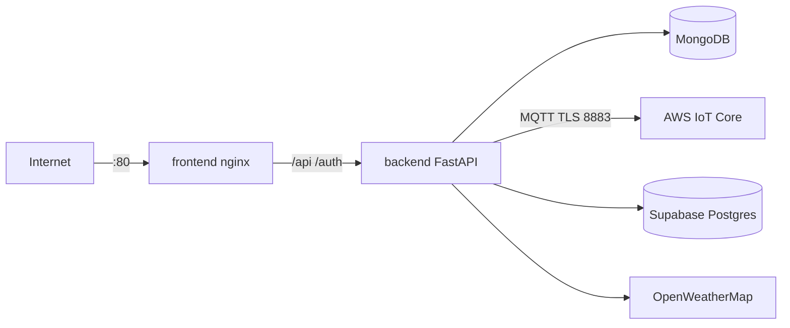

# Despliegue en AWS EC2

Guía para publicar el **Sistema de Riego Inteligente** en una instancia EC2 usando Docker Compose (backend FastAPI, frontend Vue/nginx, MongoDB local, AWS IoT Core).

## Arquitectura en el servidor



El usuario solo accede al puerto **80**. La API REST se sirve por el proxy de nginx (`/api/`, `/auth/`).

---

## 1. Crear la instancia EC2

| Parámetro | Recomendación |
|-----------|----------------|
| AMI | Ubuntu Server 22.04 LTS o 24.04 LTS |
| Tipo | `t3.small` o superior (MongoDB + build frontend) |
| Disco | 20–30 GB gp3 |
| Par de claves | Crear/descargar `.pem` para SSH |
| IP pública | Asignar Elastic IP (opcional pero recomendado) |

### Security Group (entrada)

| Puerto | Origen | Uso |
|--------|--------|-----|
| 22 | Tu IP (`x.x.x.x/32`) | SSH |
| 80 | `0.0.0.0/0` | HTTP (dashboard) |
| 443 | `0.0.0.0/0` | HTTPS (cuando configures SSL) |

No abras **27017** (MongoDB) ni **8000** (API directa) a Internet en producción; `docker-compose.prod.yml` ya los deja solo en la red Docker.

---

## 2. Conectar por SSH

```bash
chmod 400 tu-clave.pem
ssh -i tu-clave.pem ubuntu@<IP_PUBLICA_EC2>
```

En Amazon Linux el usuario suele ser `ec2-user`; en Ubuntu, `ubuntu`.

---

## 3. Instalar Docker en el servidor

Desde el repositorio (después de clonar) o copiando el script:

```bash
git clone https://github.com/<tu-org>/SistemaRiegoInteligenteTI.git
cd SistemaRiegoInteligenteTI
chmod +x scripts/*.sh
bash scripts/ec2-setup.sh
```

Cierra sesión y vuelve a entrar (para el grupo `docker`), o ejecuta `newgrp docker`.

Verifica:

```bash
docker --version
docker compose version
```

---

## 4. Variables de entorno y secretos

### 4.1 `backend/.env`

```bash
cp backend/.env.example backend/.env
nano backend/.env   # o vim
```

Ajusta al menos:

- `DEBUG=False`
- `SUPABASE_URL`, `SUPABASE_KEY` (clave **anon**, no service_role)
- `SUPABASE_DB_URL` (pooler de Supabase)
- `WEATHER_API_KEY`
- `AWS_IOT_ENDPOINT` y topics MQTT

En Docker, **no hace falta** cambiar `MONGODB_URL`: `docker-compose.yml` ya usa `mongodb://mongodb:27017`.

### 4.2 Certificados AWS IoT (`IotCore/`)

La carpeta `IotCore/` no está en Git (`.gitignore`). Cópiala desde tu máquina local:

```bash
# Desde tu PC (PowerShell o bash)
scp -i tu-clave.pem -r IotCore ubuntu@<IP_EC2>:~/SistemaRiegoInteligenteTI/
```

Debe contener, entre otros:

- `AmazonRootCA1.pem`
- `*-certificate.pem.crt`
- `*-private.pem.key`

---

## 5. Levantar la aplicación

```bash
cd SistemaRiegoInteligenteTI
chmod +x scripts/deploy-prod.sh
./scripts/deploy-prod.sh
```

Comando equivalente:

```bash
docker compose -f docker-compose.yml -f docker-compose.prod.yml up -d --build
```

### Comprobar

```bash
curl -s http://localhost/health
docker compose -f docker-compose.yml -f docker-compose.prod.yml ps
docker compose -f docker-compose.yml -f docker-compose.prod.yml logs -f backend
```

En el navegador: `http://<IP_PUBLICA_EC2>/`  
Documentación API: `http://<IP_PUBLICA_EC2>/docs`

---

## 6. HTTPS con Let's Encrypt (opcional)

Opción sencilla: **Caddy** o **nginx** en el host como reverse proxy. Ejemplo con Certbot en Ubuntu:

```bash
sudo apt-get install -y certbot
# Detén temporalmente el contenedor que usa el puerto 80 si hace falta
sudo certbot certonly --standalone -d riego.tudominio.com
```

Luego configura un proxy en el host que termine TLS en 443 y reenvíe a `127.0.0.1:80`, o monta certificados en un servicio nginx adicional. Para un dominio fijo, asocia un registro **A** en Route 53 hacia la Elastic IP.

---

## 7. Actualizar tras cambios en el código

```bash
cd SistemaRiegoInteligenteTI
git pull
./scripts/deploy-prod.sh
```

---

## 8. Supabase y red

- **Auth (login/registro):** en el dashboard de Supabase → Authentication → URL Configuration, agrega la URL del sitio, por ejemplo `http://<IP_EC2>` o `https://riego.tudominio.com`.
- **Base de datos:** Supabase ya está en la nube; la EC2 solo necesita salida a Internet (puerto 5432 al pooler).
- **AWS IoT:** la policy del certificado del backend debe permitir `subscribe`/`publish` en los topics configurados.

---

## 9. Solución de problemas

| Síntoma | Qué revisar |
|---------|-------------|
| `502` en `/api` | `docker compose logs backend`; health del backend |
| Backend no arranca | `backend/.env`, certificados en `IotCore/` |
| Sin lecturas de sensor | `GET /api/debug/mqtt` vía proxy; policy IoT |
| Login falla | `SUPABASE_KEY` anon; Site URL en Supabase |
| MongoDB vacío | Normal en instancia nueva; el ESP debe publicar a IoT |

```bash
# Logs
docker compose -f docker-compose.yml -f docker-compose.prod.yml logs -f

# Reinicio limpio
docker compose -f docker-compose.yml -f docker-compose.prod.yml down
docker compose -f docker-compose.yml -f docker-compose.prod.yml up -d --build
```

---

## 10. Resumen de comandos

```bash
# En EC2 (primera vez)
bash scripts/ec2-setup.sh
# (re-login SSH)
cp backend/.env.example backend/.env && nano backend/.env
# scp IotCore desde tu PC
./scripts/deploy-prod.sh
```

---

## Alternativa sin Docker

No recomendada para este repo (hay tres servicios + certs). Si la necesitas: instala Python 3.11, Node 20, MongoDB y Mosquitto/AWS IoT manualmente siguiendo `README.md` y `ARCHITECTURE.md`.
